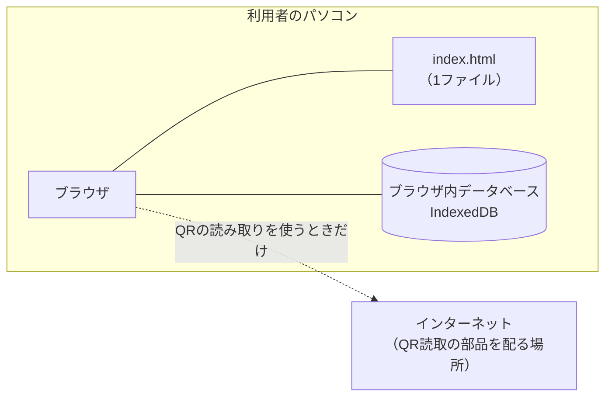
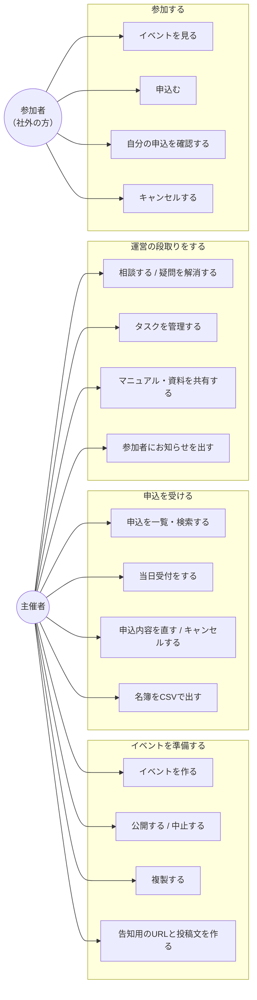
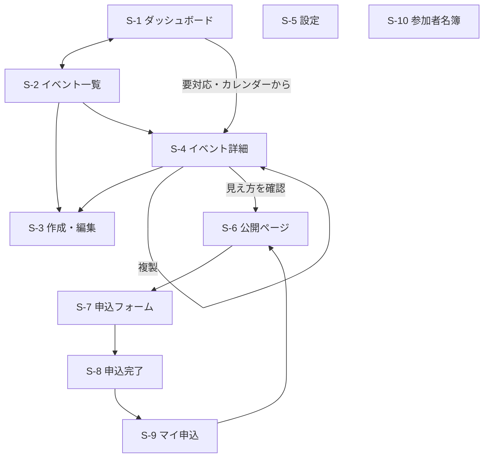
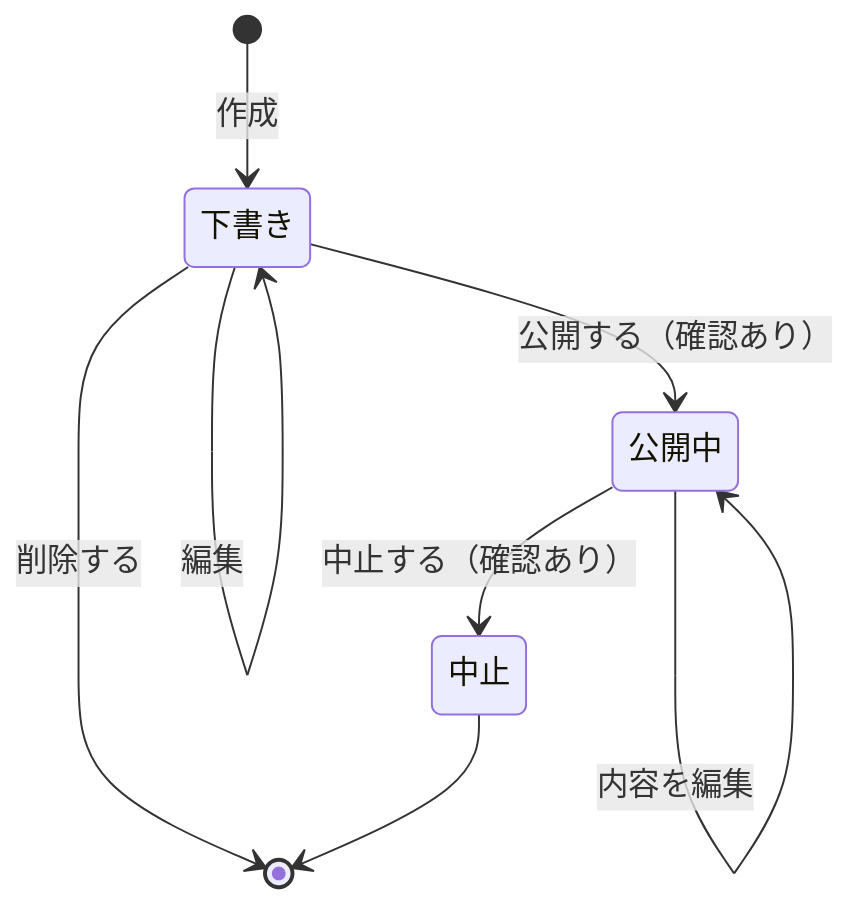
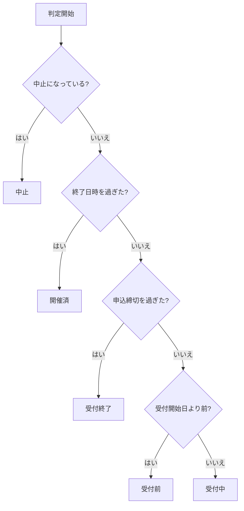
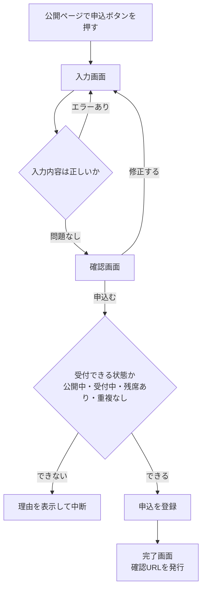
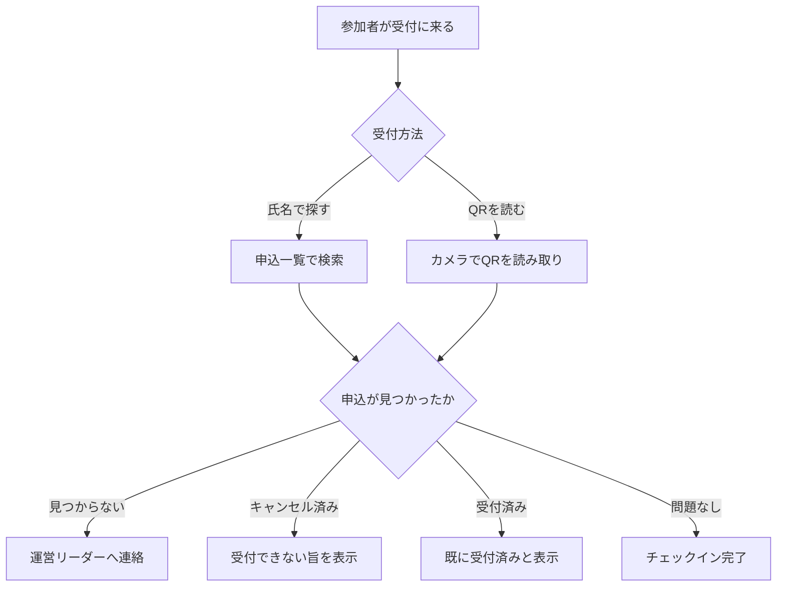
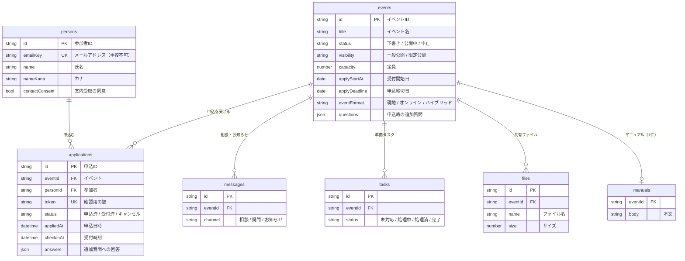

# 基本設計書

作成日：2026年7月28日
対象システム：イベント管理システム

## この文書の定義（変更しないこと）

| 項目 | 定義 |
|---|---|
| **何を作るか** | **外から見た仕様。** システムが外部にどう振る舞うかを定め、「何を作るのか」を合意する |
| **読み手** | **顧客・プロジェクト管理者（PM）** |
| **記載粒度** | **画面・機能・DB の外部仕様** |

**この文書に書かないこと**

- プログラムの内部構造（モジュール構成、関数名、変数名、ソースコードの区画）
- 実装のやり方（どの技術を使い、どう組むか）
- 開発者向けの注意事項（コーディング規約、壊れやすい箇所、テスト方法）

※ 納品物のファイル名や動作環境は外部仕様に含むため、ここに書きます。

上記は `詳細設計書.md` に書きます。**この定義に合わない記述は、加筆せず詳細設計書へ移すこと。**

**関連文書**

| 文書 | 何を作るか | 読み手 | 記載粒度 |
|---|---|---|---|
| `要件定義書.md` | 要求の確定（正典） | 顧客・PM | 機能要件 F 番号 |
| **本書** | 外から見た仕様 | 顧客・PM | 画面・機能・DB の外部仕様 |
| `機能一覧.md` | 画面ごとにできること | 顧客・PM | 機能単位 |
| `詳細設計書.md` | 内部の実装方針 | 開発者・アーキテクト | モジュール構成・処理フロー・SQL |
| `引き継ぎ書.md` | 判断の経緯 | 開発者 | 決定理由 |

## 目次

| 章 | 内容 |
|---|---|
| 1 | システムアーキテクチャ |
| 2 | ユースケース図 |
| 3 | 画面設計 |
| 4 | フローチャート図 |
| 5 | ER図（データの外部仕様） |
| 6 | リスク登録簿 |
| 7 | 決定の記録と、選ばなかった案 |

---

## 1. システムアーキテクチャ

### 1-1. 全体構成

このシステムは**利用者のパソコン1台の中だけで動きます。** サーバはありません。

| 項目 | 内容 |
|---|---|
| 動かすもの | `index.html` というファイル1つ |
| サーバ | 不要 |
| データベースソフト | 不要（ブラウザに内蔵の機能を使う） |
| インストール | 不要 |
| インターネット | 通常は不要。**QRコードの読み取り**を使うときだけ必要 |
| 起動方法 | 簡易サーバを立ち上げてブラウザで開く |

### 1-2. データの置き場所

データは**そのパソコンのブラウザの中**に保存されます。外には送られません。

| 保存するもの | 内容 |
|---|---|
| イベント | 名前・日時・会場・定員・カバー画像など |
| 参加者 | 氏名・カナ・メールアドレス |
| 申込 | どのイベントに誰が申込んだか、受付したか |
| 運営の情報 | 相談スレッド・疑問・タスク・マニュアル・共有ファイル |

### 1-3. この構成で「できないこと」

サーバがないため、次のことは**仕組み上できません。**
仕様の抜けではなく、構成から決まる制約です。

| できないこと | 何が起きるか |
|---|---|
| 複数のパソコンでデータを共有する | 主催者と参加者が別の端末を使えない。このシステムでは同じブラウザの中で役割を切り替えて再現している |
| メールを送る | 申込確認・リマインド・中止のお知らせを自動で送れない |
| 決まった時刻に自動で動かす | 締切が来たときの自動処理ができない |
| インターネットに公開する | 検索エンジンに載らない。SNSでURLを共有しても他の人は開けない |
| 複数人で同時に受付する | 受付担当を2人以上に分けられない |
| 参加者が別の端末で申込を確認する | 申込んだ端末を変えると確認できなくなる |

**このシステムは研修課題であり、単一のパソコンで完結させる前提で作られています。**
実際の運用にはサーバの導入が必要です。

### 1-4. インターネットの前提

**インターネットは利用できるものとします。** オフライン環境での動作は要件に含めません
（2026-07-28 決定 / 要件定義書 1-2・3-2）。

そのうえで、実際に通信が発生するのは次の場面だけです。

| 場面 | 通信先 |
|---|---|
| QRコードの読み取りで当日受付する | 読み取り用の部品を配布元から取得する |
| X・LINE で共有する | 押した先が外部サイト |
| 会場の地図を開く | 押した先が外部サイト |
| ヘッダーのロゴを押す | 会社サイト（押した先が外部サイト） |
| 画面を開く | 英数字の書体ファイルを配布元から取得する（失敗しても標準書体で表示される） |

イベントの作成・公開・申込の受付・氏名検索での受付・名簿出力などは、
通信せずにパソコンの中だけで完結します。

---

## 2. ユースケース図

| アクター | 説明 |
|---|---|
| 主催者 | 自社の運営担当者。1人を想定。ログインは無い |
| 参加者 | 不特定多数の社外の方（取引先・同業他社・一般）。**会員登録は不要**（イベントを探す・申込むのにログインは要らない）。**マイ申込の一覧だけログインが必要**（F-107。2026-07-29 追加） |

---

## 3. 画面設計

### 3-1. 画面一覧

| # | 画面名 | 利用者 | 目的 |
|---|---|---|---|
| S-1 | ダッシュボード | 主催者 | 全体の状況を1画面で把握する |
| S-2 | イベント一覧 | 主催者 | イベントを探す・準備状況を見る |
| S-3 | イベント作成・編集 | 主催者 | イベントの内容を登録する |
| S-4 | イベント詳細 | 主催者 | 申込の管理と運営の段取りを行う |
| S-5 | 設定 | 主催者 | デモデータの投入・初期化 |
| S-6 | 公開ページ | 参加者 | イベントを知り、申込む |
| S-7 | 申込フォーム | 参加者 | 申込内容を入力する |
| S-8 | 申込完了 | 参加者 | 申込を確認する |
| S-9 | マイ申込 | 参加者 | 自分の申込を後から見る |
| S-10 | 参加者名簿 | 主催者 | 過去の参加者を横断で見る |

各画面でできることの詳細は `機能一覧.md` にあります。

### 3-2. 画面遷移図

`S-5` と `S-10` はタブから直接開きます。

### 3-3. S-4 イベント詳細の構成

この画面だけ情報量が多いため、上部に状況を固定表示し、下を9つのタブで切り替えます。

| タブ | 用途 | 参加者から見えるか |
|---|---|---|
| 申込 | 一覧・検索・受付・修正・CSV | — |
| 運営スレッド | 運営メンバー間の相談 | 見えない |
| 運営Q&A | 疑問の登録と解消 | 見えない |
| 運営タスク | 準備タスクの管理 | 見えない |
| マニュアル | 当日の手順書 | 見えない |
| ファイル | 会場図・資料の共有 | 見えない |
| お知らせ | 参加者への連絡 | **公開ページとマイ申込に出る** |
| 告知 | 共有URL・投稿文・SNS | — |
| 概要・編集 | 内容の確認と状態の変更 | — |

### 3-4. 画面共通のルール

| 項目 | 内容 |
|---|---|
| メニュー | 主催者は4タブ（ダッシュボード／イベント／参加者／設定）、参加者は2タブ |
| ヘッダー左端 | 会社ロゴを置き、クリックで日本コムシンク株式会社のサイト（`https://comthink.co.jp/`）を新しいタブで開く |
| 役割の切替 | 画面上部のヘッダーで切り替える |
| 配色 | **日本コムシンク株式会社サイトに合わせる**（本文 `#20272e` / アクセント `#194bf4` / 罫線 `#dee5ed`）。状態を表す色だけは意味を持つので別扱い |
| 書体 | 英数字は**サイトと同じ Jost**。日本語は容量の都合でサイトと同じ書体を同梱できず、端末の標準書体を使う。読み込めない場合も表示は崩れない |
| 画面幅 | パソコン向けのみ。スマートフォン対応は未実施（リスク R-10） |
| メッセージ | 入力エラーは項目の下／完了は右下に一時表示／システムエラーは上部に固定／取り消せない操作は確認画面 |

### 3-5. 利用者による見え方の違い

| 対象 | 主催者 | 参加者 |
|---|---|---|
| 下書きのイベント | 見える | 見えない |
| 限定公開のイベント | 一覧に出る | 一覧に出ない。URLを直接開いたときだけ |
| 定員と残席 | 実数 | 残席、または「満席」 |
| 他人の申込 | 全部見える | 見えない |
| オンラインの視聴URL | — | 申込んだ人だけに表示 |
| 参加者名簿 | パスワード入力後に見える | 見えない |

---

## 4. フローチャート図

### 4-1. イベントの状態

**一度進むと戻れません。**
公開したら下書きに戻せず、中止も取り消せません。削除できるのは下書きだけです。
「記録を消さない」という方針で統一しています。

そのため、公開と中止のボタンには必ず確認画面を出します。

### 4-2. 受付状況の判定

イベントの状態とは別に、日付から「受付状況」を自動で判定します。
**保存はせず、画面を開くたびに計算します。**

この結果によって、公開ページの申込ボタンの文言が変わります。

### 4-3. 申込の流れ

一度キャンセルした人が、同じイベントに申し込み直すことはできます。

### 4-4. 当日受付の流れ

QRでの受付はパソコン1台のみです。複数人で分担することはできません。

## 5. ER図（データの外部仕様）

### 5-1. 前提

ブラウザ内蔵のデータベースは、一般的なリレーショナルデータベースとは異なります。

- 外部キー制約がありません（関連の正しさはプログラム側で守ります）
- テーブルの結合機能がありません

下図は「もし一般的なデータベースで作るなら」という形で表したものです。

### 5-2. 図

上図のほかに、確認用の鍵をパソコンに控えておく領域と、既読の時刻を記録する領域があります。

### 5-3. データについての決めごと

| 決めごと | 理由 |
|---|---|
| 参加者はメールアドレスで1人にまとめる | 同じ人が何度も申込んでも、名簿では1人として扱うため |
| 同じ人が同じイベントに複数の申込を持てる | キャンセル後に申し込み直せるようにするため |
| 申込の記録は削除しない | キャンセルしても状態を変えるだけ。記録は残す |
| 受付状況は保存しない | 日付から毎回計算する。保存するとズレが生じる |
| 所属（会社・学校）は参加者ではなく申込に持つ | 所属は時期によって変わるため |
| データの保持期間は無期限 | 過去の参加履歴を次回に活かすため |

### 5-4. データ量の目安

| 対象 | 想定 |
|---|---|
| イベント | 数十件 |
| 参加者 | 数百人 |
| 1イベントあたりの申込 | 数百件 |
| 共有ファイル | 1ファイル20MBまで |

## 6. リスク登録簿

| ID | リスク | 影響 | 起きやすさ | 対応方針 | 状態 |
|---|---|---|---|---|---|
| R-01 | 外部部品が改ざんされる（改ざん検知が未設定） | 大：申込一覧の画面で動くため、個人情報を読み取られうる | 低 | **QR生成の部品は製品に同梱して解消済み。QR読み取りの部品は外部取得のままで、改ざん検知が未設定** | **一部未対応** |
| R-02 | 画像・ファイルの保存が自動テストで確認できていない | — | — | **2026-07-28 にブラウザで手動確認し、正常に動作することを確認した。** 自動テストでは今後も検証できないため、この箇所を変更したら都度手動で確認する | 解消 |
| R-03 | ブラウザのデータを消すと全部失われる | 大：復旧できない | 中 | 現状は受け入れる。サーバ導入で解消 | 受容 |
| R-04 | 1台完結のため実運用に耐えない | 大：参加者は必ず別の端末 | 高（運用時） | 研修課題として割り切る。制約を明記 | 受容 |
| R-05 | 競合サービスの調査結果に出典が無い | 小：優劣の主張には使えない | — | **主張そのものを取り下げた**（`Peatix比較.md` 2章を「本システム側の作り」に書き替え）。本プロジェクトの目標は機能をある程度模倣することであり、優劣を示すことではない | 受容 |
| R-06 | ファイルが4,100行あり、想定上限に近い | 中：改修しにくくなる | 中 | 分割方針を見直す | 監視中 |
| R-07 | 件数が増えると一覧画面が遅くなる | 小：現状の規模では問題なし | 低 | 読み込み方を変える | 保留 |
| R-08 | 名簿のパスワードが十分な保護だと誤解される | 中：安全だと思って実データを入れてしまう | 中 | 画面と文書に限界を明記済み | 対応済み |
| R-09 | 限定公開でもSNS共有ボタンが出る | 小：イベント名が外部に出る | 低 | **限定公開では共有できないようにする方針で決定済み。実装は保留** | 保留（方針決定済み） |
| R-10 | スマートフォンに対応していない | 中：社外の参加者が申込めない可能性 | 高 | 対応要否を検討中 | 検討中 |
| R-11 | 日本語書体がサイトと異なる | 小：見た目の統一が英数字と配色に留まる | — | **対応しないと決定**（同梱すると約449KB増える。`<link>` での外部CSS読み込みは技術方針に反する） | 受容 |

---

## 7. 決定の記録と、選ばなかった案

将来の参照のため、**採用しなかった案も残します。** 経緯は `引き継ぎ書.md` にあります。

| 決めたこと | 選ばなかった案 | 選んだ理由 |
|---|---|---|
| 受付状況は保存せず毎回計算する | 状態として保存し、締切時に更新する | 決まった時刻に自動で動かせないため、保存すると実態とズレる |
| 定員はイベントが持つ | チケットの種類ごとに持つ | 無料イベントで「チケットを買う」操作は不要と判断し、チケット制をやめた |
| 社外向けイベントのみを扱う | 社外向け／社内外／社内向けを選べるようにする | 選択肢が1つしかない項目を利用者に聞かない |
| 所属は申込時の質問として聞く | 参加者情報に会社名を持たせる | 所属は時期によって変わるため |
| 所属は「会社／学校／なし」から選ぶ | 会社名を自由に書いてもらう | 学生や個人の方が答えられない |
| 準備の進捗はタスクの完了率を使う | 進捗率の項目を別に設ける | 別に持つとタスクの実態とズレる |
| 名簿にパスワードを付ける | 付けない | 秘密は守れないが、うっかり開くのは防げる |
| 代理申込・譲渡・抽選は作らない | 作る | 順に、名寄せが壊れる／本人確認ができない／当落を知らせる手段がない |
| マニュアルの表示部品を自作する | 外部の部品を使う | 第三者の部品を増やしたくないため。入力された文字をそのまま解釈しない扱いを自分で保証できる |
