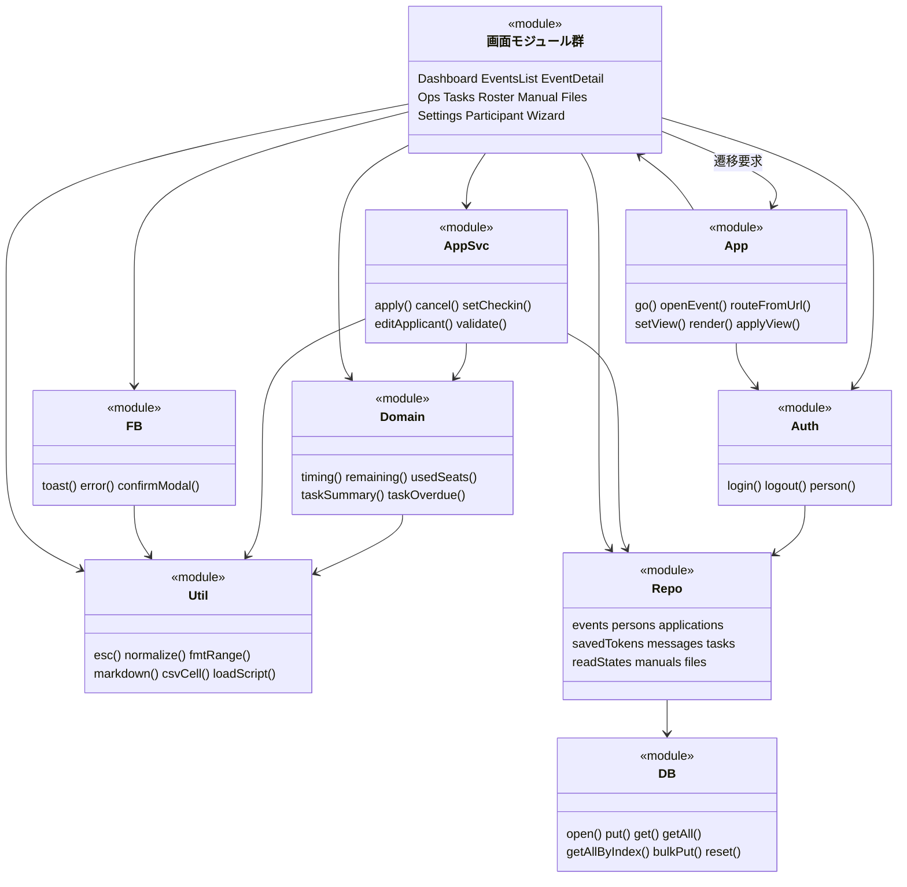
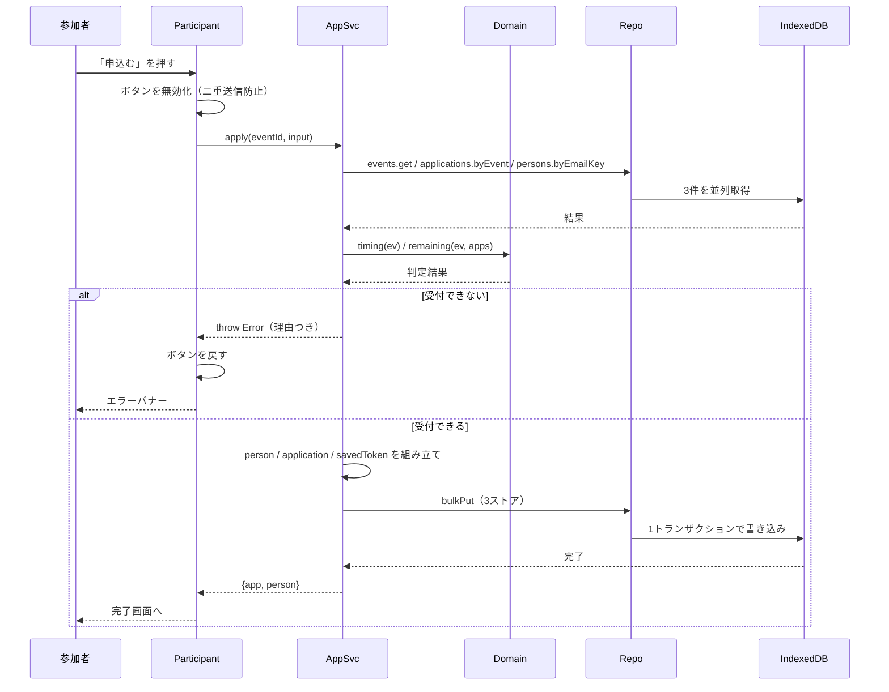
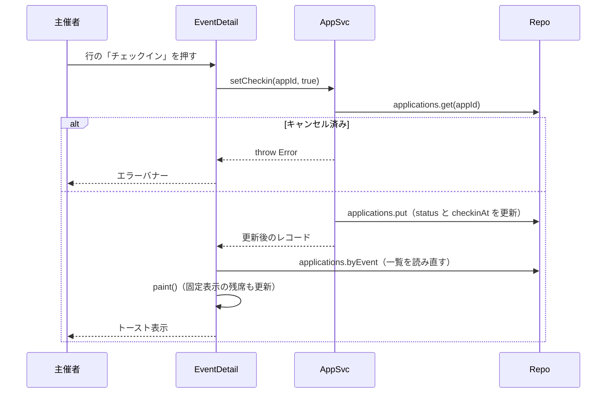
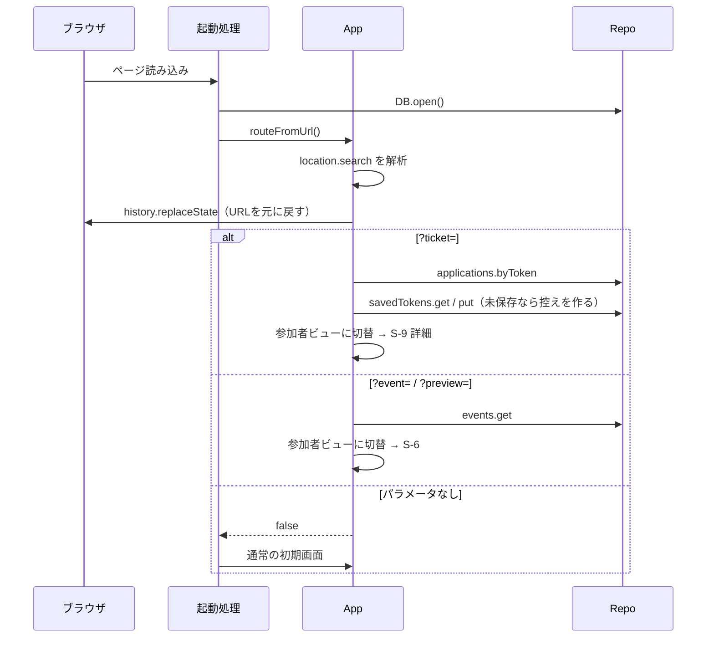
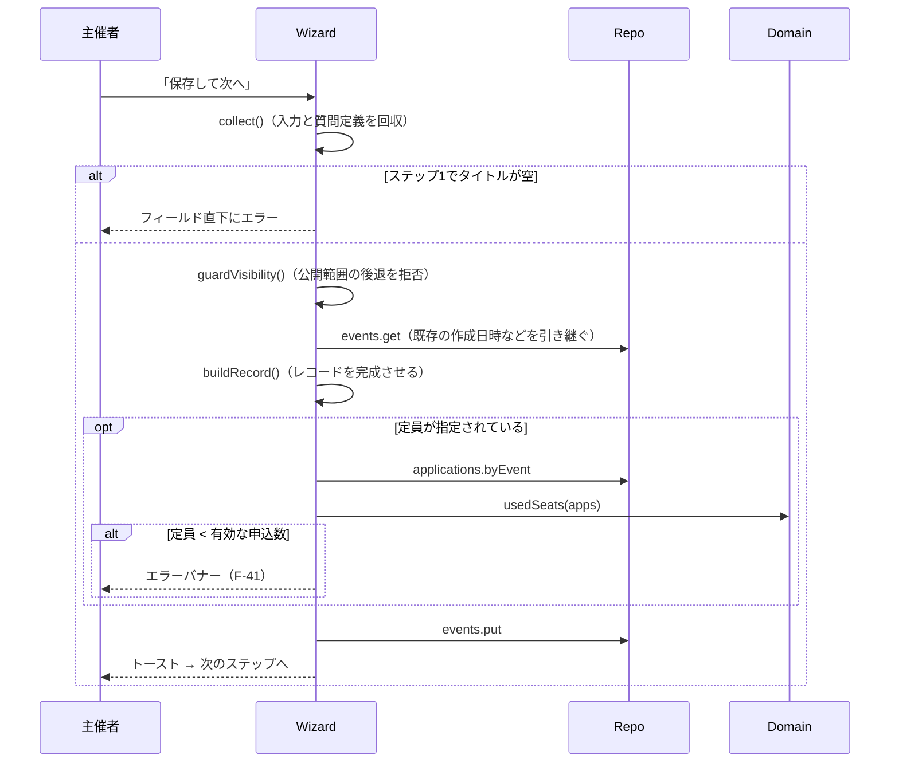

# 詳細設計書

作成日：2026年7月28日
対象：`index.html`（全体 約7,000行＝本体 約4,000行＋同梱QRライブラリ 約2,300行・スキーマ v5）

## この文書の定義（変更しないこと）

| 項目 | 定義 |
|---|---|
| **何を作るか** | **内部の実装方針。** 基本設計で決めた機能を、どう組んで実装するかを示す |
| **読み手** | **開発者・アーキテクト** |
| **記載粒度** | **クラス/モジュール構成・処理フロー・SQL** |

**この文書に書かないこと**

- 要求の妥当性（`要件定義書.md`）
- 外から見た仕様（`基本設計書.md`）

**この文書のゴール**：同じ設計書から、同じ構造のコードが再現できること。

## 目次

| 章 | 内容 |
|---|---|
| 1 | 実装方針 |
| 2 | モジュール構成（クラス図相当） |
| 3 | モジュールとメソッドの定義 |
| 4 | 処理フロー（シーケンス図） |
| 5 | メソッド仕様 |
| 6 | データベース設計の詳細 |
| 7 | データ操作（SQL との対比） |
| 8 | 正規化レポート |
| 9 | 画面実装の方針 |
| 10 | 非機能要求の実装基準 |
| 11 | 壊れやすい箇所 |
| 12 | リスク管理の詳細 |
| 13 | 変更時のチェックリスト |

---

## 1. 実装方針

### 1-1. 全体の方針

| 方針 | 内容 | 理由 |
|---|---|---|
| 単一ファイル | `index.html` に HTML・CSS・JS をすべて入れる | 課題の制約。ビルド工程を持たない |
| モジュールパターン | クラスを使わず、即時関数（IIFE）で名前空間を作る | ビルドが無いため ES Modules が使えない。グローバル汚染は避けたい |
| 区画分割 | `// ===== [n] 名前 =====` で区切る | 全体を再生成せず、部分的に直せるようにする |
| 描画方式 | テンプレート文字列を組み立てて `innerHTML` に全置換 | 仮想DOMを持たない。データ量が小さいため差分更新は不要 |
| 非同期 | IndexedDB のイベントAPIを Promise でラップし、呼び出し側は `async/await` | コールバックを上位に露出させない |
| 層の分離 | 画面 → 業務処理 → データアクセス の一方向 | サーバ導入時に下層だけ差し替えられるようにする |

### 1-2. 禁止事項

| 禁止 | 代わりに | 理由 |
|---|---|---|
| `Math.random()` | `crypto.getRandomValues()` | トークンが推測されると他人の申込が見える |
| `localStorage` / `sessionStorage` | IndexedDB | 永続データの置き場を1つにする |
| 外部ファイルの追加 | インライン化、または CDN の遅延読込 | 単一ファイルの制約 |
| 画面からの `DB.*` 直接呼び出し | `Repo.*` 経由 | サーバ差し替え点を1か所に保つ |
| トランザクション内での他の `await` | 事前にデータを揃えてから開始 | トランザクションが勝手に閉じる |

これらは `tests/guard.js` が機械的に検査し、CI で落とします。

---

## 2. モジュール構成（クラス図相当）

### 2-1. クラスを使わない理由

このシステムに `class` は1つもありません。すべて即時関数によるモジュールです。

- 状態を持つのは画面モジュールだけで、インスタンスを複数作る必要がない
- 継承の必要がない
- ビルドが無いため、モジュール間の依存は「定義順」で担保している

そのためクラス図の代わりに、**モジュール関連図**を示します。

### 2-2. モジュール関連図



### 2-3. 区画と依存関係（実測）

定義順に並んでいます。**下の区画が上の区画を呼びます。**
`App` と画面モジュールだけは相互に呼び合います（画面が遷移を要求するため）。

| 区画 | モジュール | 依存先 |
|---|---|---|
| `[1]` | `Util` | なし |
| `[2]` | `DB` | なし |
| `[3]` | `Repo` | DB |
| `[4]` | `Domain` | Util |
| `[4b]` | `AppSvc` | Util, Repo, Domain |
| `[5]` | `FB` | Util |
| `[6]` | `Seed` | Util, Repo |
| `[7]` | `Dashboard` | Util, Repo, Domain, App |
| `[8]` | `EventsList` | Util, Repo, Domain, Ops, App |
| `[9]` | `EventDetail` | Util, Repo, Domain, AppSvc, FB, Ops, Tasks, Manual, Files, App |
| `[9b]` | `Ops` | Util, Repo, FB |
| `[9c]` | `Tasks` | Util, Repo, Domain, FB |
| `[9d]` | `Roster` | Util, Repo, Domain, FB, App |
| `[9e]` | `Manual` | Util, Repo, FB |
| `[9f]` | `Files` | Util, Repo, FB |
| `[9g]` | `Notify` | Util, Repo, DB(getAll), Auth, App |
| `[10]` | `Settings` | Repo, FB, Seed, App |
| `[11]` | `Participant` | Util, Repo, Domain, AppSvc, FB, Ops, Auth, App |
| `[11b]` | `Auth` | Repo |
| `[12]` | 汎用ヘルパ（`groupBy` / `coverUrl` / `coverHtml` / `coverBand`） | Util |
| `[12b]` | `Wizard` | Util, Repo, Domain, FB, App |
| `[13]` | `App` | Util, Repo, FB, Auth, Notify, 画面モジュール群 |
| `[14]` | 起動処理 | DB, Repo, App, FB |

**循環依存は `App` ⇄ 画面モジュールの1組だけです。**
呼び出しは実行時（クリック時）なので、定義順の問題は起きません。

`Auth`（`[11b]`）は `Participant` より後に定義されていますが、`Participant` が `Auth` を
呼ぶのは実行時（マイ申込を開いたとき）なので問題になりません。**画面より下に置いたのは、
`Auth` が Repo だけに依存する小さなモジュールで、画面の並びを崩したくなかったためです。**

---

## 3. モジュールとメソッドの定義

### 3-1. `Util`（区画 [1]）— 純関数のみ

| 関数 | シグネチャ | 内容 |
|---|---|---|
| `esc` | `(s) => string` | HTML エスケープ |
| `randHex` | `(bytes) => string` | `crypto.getRandomValues` で乱数16進 |
| `uid` | `() => string` | 8バイトのID |
| `newToken` | `() => string` | 16バイトのトークン |
| `normalize` | `(s) => string` | NFKC → 小文字 → カタカナをひらがなへ → 空白除去 |
| `toKatakana` | `(s) => string` | ひらがな→カタカナ |
| `fmtDateTime` | `(iso) => string` | `YYYY/MM/DD HH:mm` |
| `fmtDate` | `(iso) => string` | `YYYY/MM/DD`。日付のみの文字列は UTC 解釈を避ける |
| `fmtRange` | `(startAt, endAt) => string` | 同日なら終了は時刻のみ |
| `deadlineEnd` | `(dateStr) => number\|null` | 締切日の 23:59:59 のミリ秒 |
| `dayStart` | `(dateStr) => number\|null` | 開始日の 00:00:00 のミリ秒 |
| `weekStartMonday` | `(now) => number` | その週の月曜 0時 |
| `daysBetween` | `(a, b) => number` | 日数差 |
| `csvCell` | `(v) => string` | エスケープ＋数式無害化 |
| `buildCsv` | `(rows) => string` | BOM付き・CRLF |
| `downloadText` | `(filename, text, mime?) => void` | Blob を生成してダウンロード |
| `copy` | `(text) => Promise<boolean>` | クリップボード |
| `loadScript` | `(src, globalName) => Promise<any>` | CDN の遅延読込。二重読込を防ぐ |
| `markdown` | `(src) => string` | Markdown をHTMLへ（自前実装） |

### 3-2. `DB`（区画 [2]）

| 関数 | シグネチャ | 内容 |
|---|---|---|
| `open` | `() => Promise<IDBDatabase>` | 接続とバージョン移行 |
| `db` | `() => IDBDatabase` | 接続の取得 |
| `put` | `(store, rec) => Promise<key>` | 1件の登録・更新 |
| `get` | `(store, key) => Promise<any>` | 1件取得 |
| `getAll` | `(store) => Promise<any[]>` | 全件取得 |
| `remove` | `(store, key) => Promise<void>` | 1件削除 |
| `getAllByIndex` | `(store, index, value) => Promise<any[]>` | インデックス検索 |
| `bulkPut` | `(entries) => Promise<void>` | 複数ストアを1トランザクションで |
| `reset` | `() => Promise<void>` | DB削除→再作成 |

`_wrap(req)` が `onsuccess` / `onerror` を Promise に変換します。
**この関数の外にイベントAPIを出しません。**

### 3-3. `Repo`（区画 [3]）— データアクセスの唯一の窓口

| ストア | メソッド |
|---|---|
| `events` | `all() get(id) put(e) remove(id)` |
| `persons` | `all() get(id) byEmailKey(k) put(p)` |
| `applications` | `all() get(id) byEvent(eventId) byPerson(personId) byToken(token) put(a)` |
| `savedTokens` | `all() get(token) put(t)` |
| `messages` | `all() byEvent(eventId) put(m) remove(id)` |
| `tasks` | `all() byEvent(eventId) put(t) remove(id)` |
| `readStates` | `all() get(key) put(r)` |
| `manuals` | `get(eventId) put(m) remove(eventId)` |
| `files` | `byEvent(eventId) get(id) put(f) remove(id)` |
| 共通 | `bulkPut(entries) reset()` |

すべて Promise を返します。**サーバ化時はここだけを HTTP 呼び出しに差し替えます。**

### 3-4. `Domain`（区画 [4]）— 計算のみ、保存しない

| 関数 | シグネチャ | 戻り値 |
|---|---|---|
| `timing` | `(ev, now?) => {phase, label}` | `phase` は `cancelled/held/closed/before/open` |
| `capacity` | `(ev) => number` | 定員（未設定は0） |
| `isValidApp` | `(a) => boolean` | 状態が `applied` または `checkedin` |
| `usedSeats` | `(apps) => number` | 有効な申込数 |
| `remaining` | `(ev, apps) => number` | 残席 |
| `applyButtonLabel` | `(ev, apps) => {text, disabled}` | 申込ボタンの文言 |
| `nearlyFull` | `(ev, apps) => boolean` | 残3以下 または 定員の10%以下 |
| `staleDraft` | `(ev, now?) => boolean` | 下書きで7日以上更新なし |
| `taskOverdue` | `(t, now?) => boolean` | 期限超過（`review`・`done` は除く） |
| `taskSummary` | `(tasks, now?) => {by, total, done, rate, overdue}` | タスク集計 |

定数：`STATUS` `FORMAT` `TASK_STATUS` `TASK_FLOW` `PRIORITY`

### 3-5. `AppSvc`（区画 [4b]）— 申込の業務処理

| 関数 | シグネチャ | 内容 |
|---|---|---|
| `apply` | `(eventId, input) => Promise<{app, person}>` | 申込の確定 |
| `cancel` | `(appId) => Promise<app>` | キャンセル |
| `setCheckin` | `(appId, on) => Promise<app>` | 受付・取消 |
| `editApplicant` | `(appId, {name,kana,email}) => Promise<person>` | 申込者情報の修正 |
| `validate` | `(d) => {name?, kana?, email?}` | 入力検証 |
| `emailKeyOf` | `(email) => string` | trim + 小文字化のみ |
| `searchTextOf` | `(p) => string` | 検索用文字列の生成 |

**主催者側と参加者側が同じ関数を呼びます。** 画面から `Repo.applications.put` を直接呼びません。

---

## 4. 処理フロー（シーケンス図）

### 4-1. 申込の確定



**検証はすべてトランザクションの外**で行い、書き込みは1回にまとめます。

### 4-2. 当日受付（チェックイン）



QR受付の場合は、`jsQR` で読み取ったトークンから該当申込を探し、同じ `setCheckin` を呼びます。

### 4-3. URL からの復帰



URL は**解析の直後・処理より先に**戻します。再読み込みで同じ処理が二重に走らないようにするためです
（パラメータが無い場合は何もしません）。

### 4-4. イベントの保存（ウィザード）



---

## 5. メソッド仕様

主要なものだけ抜粋します。

### 5-1. `AppSvc.apply(eventId, input)`

| 項目 | 内容 |
|---|---|
| 引数 | `eventId: string`, `input: {name, kana, email, consent, answers}` |
| 戻り値 | `Promise<{app, person}>` |
| 例外 | 下表の条件で `Error` を投げる |
| 副作用 | `persons` / `applications` / `savedTokens` に1トランザクションで書き込む |

**検証（この順で評価し、最初に該当したものを投げる）**

| 順 | 条件 | メッセージ |
|---|---|---|
| 1 | イベントが無い、または `status !== "published"` | このイベントには申込できません |
| 2 | `timing().phase !== "open"` | {受付前／受付終了／開催済／中止}のため申込できません |
| 3 | `remaining <= 0` | 定員に達したため申込できません |
| 4 | 同一人物の有効な申込が既にある | このイベントには既に申込済みです |

**生成するデータ**

| 項目 | 値 |
|---|---|
| `person.id` | 既存があれば流用、無ければ `Util.uid()` |
| `person.emailKey` | `email` を trim + 小文字化 |
| `person.nameKana` | 入力をカタカナへ変換 |
| `application.token` | `Util.newToken()`（16バイト） |
| `application.searchText` | 氏名＋カナ＋メールを正規化して連結 |
| `savedToken` | `{token, eventId, savedAt}` |

**注意**：残席の判定は直前の読み取り値に基づきます。単一ブラウザ前提のため排他制御は行いません。

### 5-2. `AppSvc.editApplicant(appId, {name, kana, email})`

| 項目 | 内容 |
|---|---|
| 副作用 | `persons` を更新し、**その人の全申込の `searchText` を再計算**する |
| 例外 | 変更後の `emailKey` を既に別人が使っている場合は拒否 |

拒否する理由は、名寄せの誤統合を後から分離するのが困難なためです。

### 5-3. `Domain.timing(ev, now)`

| 順 | 条件 | 戻り値 |
|---|---|---|
| 1 | `status === "cancelled"` | `{phase:"cancelled", label:"中止"}` |
| 2 | `endAt < now` | `{phase:"held", label:"開催済"}` |
| 3 | `deadlineEnd(applyDeadline) < now` | `{phase:"closed", label:"受付終了"}` |
| 4 | `now < dayStart(applyStartAt)` | `{phase:"before", label:"受付前"}` |
| 5 | それ以外 | `{phase:"open", label:"受付中"}` |

**評価順を変えないこと。** 1 を後ろに回すと、中止したイベントが「開催済」になります。

### 5-4. `Util.csvCell(v)`

```
1. 文字列化する
2. 先頭が = + - @ タブ CR のいずれかなら、先頭に ' を付ける
3. カンマ・引用符・改行を含むなら " で囲み、内部の " を "" に置換する
```

2 は CSV インジェクション対策です。表計算ソフトが数式として実行するのを防ぎます。
副作用として負数にも `'` が付きますが、現在の出力に負数の列はありません。

### 5-5. `Util.markdown(src)`

```
1. 全体を esc() でエスケープ
2. 行単位でブロック判定（フェンスコード → 見出し → 水平線 → 表 → 引用 → 箇条書き → 番号付き → 段落）
3. 各ブロック内でインライン置換（code, strong, del, em, link）
```

**リンクは `https?:` のみ許可します。** `javascript:` を通しません。
1 のエスケープにより行頭の `>` は `&gt;` になるため、引用の判定は `&gt;` で行います。

---

## 6. データベース設計の詳細

### 6-1. ストア定義

| ストア | keyPath | インデックス | unique |
|---|---|---|---|
| `events` | `id` | `status`, `startAt` | — |
| `persons` | `id` | `emailKey` | ✅ |
| `applications` | `id` | `eventId`, `personId`, `token`, `[eventId, status]` | `token` のみ |
| `savedTokens` | `token` | `savedAt` | — |
| `messages` | `id` | `eventId`, `[eventId, channel]` | — |
| `tasks` | `id` | `eventId` | — |
| `readStates` | `key` | `eventId` | — |
| `manuals` | `eventId` | — | — |
| `files` | `id` | `eventId` | — |

### 6-2. キー設計

| ストア | キーの決め方 | 理由 |
|---|---|---|
| ほとんど | `Util.uid()`（`crypto` の8バイト） | 連番だと他のイベントIDを推測できる |
| `applications.token` | `crypto` の16バイト | 確認URLの鍵。推測されると他人の申込が見える |
| `savedTokens` | `token` 自体 | 1トークン1件のため |
| `readStates` | `` `${eventId}:${channel}` `` | 複合キーの代わり。1組1件を保証する |
| `manuals` | `eventId` | 1イベント1件のため |

### 6-3. 意図的に張っていない制約

| 制約 | 張らない理由 |
|---|---|
| `applications` の `[eventId, personId]` に unique | キャンセル後の再申込を許すため。同じ人が同じイベントに複数レコードを持つ |
| 外部キー制約 | IndexedDB に機能が無い。整合性はアプリ側で守る |

### 6-4. マイグレーション

`onupgradeneeded` で **create-if-missing 方式**を採ります。
既存ストアには触れず、無いものだけ作ります。

| ver | 変更 | 注意 |
|---|---|---|
| v1 | `events` `ticketTypes` `persons` `applications` `savedTokens` | — |
| v2 | `ticketTypes` を削除、`messages` `tasks` を追加 | 削除は `deleteObjectStore` |
| v3 | `readStates` を追加 | — |
| v4 | `manuals` を追加 | — |
| v5 | `files` を追加 | — |

**項目の追加だけならバージョンを上げません。** IndexedDB はスキーマレスなので、
新しいストアや新しいインデックスが必要なときだけ上げます。

### 6-5. トランザクション設計

| 場面 | 対象ストア | 実装 |
|---|---|---|
| 申込の確定 | persons, applications, savedTokens | `bulkPut` |
| タスクの並べ替え | tasks | `bulkPut`（変化したレコードのみ） |
| ファイルの複数追加 | files | `bulkPut` |
| 申込者情報の修正 | persons, applications | `bulkPut` |
| シード投入 | 全ストア | `bulkPut` |
| その他 | 単一 | `put` / `remove`（暗黙のトランザクション） |

**トランザクション開始前にレコードを完成させます。** 途中で `await` すると閉じるためです。

---

## 7. データ操作（SQL との対比）

IndexedDB に SQL はありません。将来サーバへ移行する際の参考として、
**主要な操作を SQL で書いた場合と対比**します。

### 7-1. イベント一覧（時期で分類）

```sql
-- SQL なら
SELECT * FROM events
WHERE (start_at IS NULL AND status <> 'cancelled')
   OR (status = 'cancelled')
   OR (start_at < NOW())
   OR (start_at >= NOW())
ORDER BY start_at;
```

```js
// 本システム：全件取得してコード側で分類する
const events = await Repo.events.all();
for (const e of events) { /* undated / upcoming / past に振り分け */ }
```

**理由**：件数が数十件のため。インデックス `startAt` はあるが範囲検索を使っていない。

### 7-2. あるイベントの申込一覧

```sql
SELECT a.*, p.name, p.name_kana, p.email
FROM applications a JOIN persons p ON a.person_id = p.id
WHERE a.event_id = ?;
```

```js
// 本システム：JOIN が無いので2回読んでコード側で突き合わせる
const [apps, personsArr] = await Promise.all([
  Repo.applications.byEvent(eventId),   // インデックス eventId を使用
  Repo.persons.all(),
]);
const persons = {}; personsArr.forEach(p => persons[p.id] = p);
```

### 7-3. 残席の算出

```sql
SELECT e.capacity - COUNT(a.id) AS remaining
FROM events e LEFT JOIN applications a
  ON a.event_id = e.id AND a.status IN ('applied','checkedin')
WHERE e.id = ? GROUP BY e.id;
```

```js
Domain.remaining(ev, apps);   // capacity - apps.filter(isValidApp).length
```

### 7-4. メールアドレスによる名寄せ

```sql
SELECT * FROM persons WHERE email_key = ? LIMIT 1;
```

```js
await Repo.persons.byEmailKey(key);   // unique インデックスを使用
```

### 7-5. 申込者の絞り込み（正規化検索）

```sql
-- SQL なら LIKE。ただし表記ゆれは吸収できない
SELECT * FROM applications WHERE search_text LIKE '%' || ? || '%';
```

```js
// 本システム：登録時に正規化済み文字列を保持しておき、前方一致ではなく部分一致
const q = Util.normalize(query);
apps.filter(a => !q || a.searchText.includes(q));
```

**設計判断**：検索のたびに全件を正規化し直すと遅いため、`applications.searchText` に
正規化済みの値を保持します（非正規化。8章参照）。

### 7-6. 参加者名簿（横断集計）

```sql
SELECT p.*, COUNT(a.id) AS total,
       SUM(CASE WHEN a.status='checkedin' THEN 1 ELSE 0 END) AS attended,
       MAX(a.applied_at) AS last_applied
FROM persons p LEFT JOIN applications a ON a.person_id = p.id
GROUP BY p.id ORDER BY total DESC;
```

```js
const [persons, apps] = await Promise.all([Repo.persons.all(), Repo.applications.all()]);
const byPerson = groupBy(apps, "personId");
// コード側で件数・来場回数・最終申込日を集計してソート
```

### 7-7. 今週の申込数（中止イベントを除外）

```sql
SELECT COUNT(*) FROM applications a JOIN events e ON a.event_id = e.id
WHERE e.status <> 'cancelled'
  AND a.status IN ('applied','checkedin')
  AND a.applied_at >= ?;   -- 今週の月曜
```

```js
const cancelledIds = new Set(events.filter(e => e.status === "cancelled").map(e => e.id));
apps.filter(a => Domain.isValidApp(a) && !cancelledIds.has(a.eventId)
                 && new Date(a.appliedAt).getTime() >= Util.weekStartMonday(now)).length;
```

### 7-8. 未読件数

```sql
SELECT COUNT(*) FROM messages m
LEFT JOIN read_states r ON r.key = m.event_id || ':' || m.channel
WHERE m.event_id = ? AND m.channel = 'thread'
  AND (r.last_read_at IS NULL OR m.created_at > r.last_read_at);
```

```js
const r = reads[`${eventId}:thread`];
const since = r ? new Date(r.lastReadAt).getTime() : 0;
msgs.filter(m => m.channel === "thread" && new Date(m.createdAt).getTime() > since).length;
```

### 7-9. サーバ移行時の注意

| 現状 | 移行時の課題 |
|---|---|
| 全件取得してコード側で絞り込み | ネットワーク越しでは非現実的。サーバ側のクエリに置き換える |
| `bulkPut` による複数ストアの原子的更新 | トランザクションAPIの設計が必要 |
| `searchText` による部分一致 | 全文検索の仕組みに置き換える余地がある |
| 排他制御なし | 定員判定に競合が発生する。悲観ロックか、登録時の再検査が必要 |

---

## 8. 正規化レポート

### 8-1. 前提

IndexedDB は正規形の概念を持ちません。以下は
**「リレーショナルDBに置き換えたときにどの正規形か」**を評価したものです。

### 8-2. 正規形の評価

| ストア | 評価 | 説明 |
|---|---|---|
| `events` | 第3正規形（一部例外） | `questions` が配列。1項目に複数値を持つため第1正規形違反 |
| `persons` | 第3正規形 | 主キー以外に関数従属なし |
| `applications` | 第3正規形（一部例外） | `answers` がオブジェクト。`searchText` は導出項目 |
| `messages` | 第2正規形 | `channel` によって使う項目が異なる（`title`/`answer`/`resolved`） |
| `tasks` | 第3正規形 | — |
| `files` | 第3正規形（一部例外） | `size`・`type` は `blob` から導出可能 |
| `readStates` | 第3正規形 | 複合キーを文字列で表現 |
| `manuals` | 第3正規形 | — |

### 8-3. 意図的な非正規化

**すべて理由があって崩しています。** 直す前にここを読んでください。

| 箇所 | 崩している内容 | 理由 |
|---|---|---|
| `applications.searchText` | 氏名・カナ・メールから導出できる | 検索のたびに全件を正規化し直すと遅い。更新時に再計算する運用で担保 |
| `events.questions[]` | 質問を別テーブルにできる | 質問はイベントと一体で、単独で参照しない。分けると読み込みが2回になる |
| `applications.answers{}` | 回答を別テーブルにできる | 同上。申込と必ずセットで読む |
| `files.size` / `files.type` | `blob` から取得できる | 一覧表示が Blob の取り出しに依存しないようにするため。**Blob が失われる環境でも一覧と削除が動く** |
| `messages` の1テーブル3用途 | `channel` ごとにテーブルを分けられる | 構造がほぼ同じで、分けると同じコードが3つになる |

### 8-4. 非正規化に伴う整合性の担保

| 項目 | いつ再計算するか |
|---|---|
| `applications.searchText` | 申込作成時、および `editApplicant` で人を更新したとき（その人の全申込） |
| `files.size` / `type` | 追加時のみ。あとから変わらない |

---

## 9. 画面実装の方針

### 9-1. 共通のパターン

```js
const 画面モジュール = (() => {
  let ctx = null;              // 画面固有の状態
  async function render(el, param) {
    const data = await Promise.all([...]);   // 必要なデータを並列取得
    ctx = { ...data, el };
    paint();
  }
  function paint() {
    ctx.el.innerHTML = `...テンプレート文字列...`;
    // innerHTML の直後にイベントを張り直す
    ctx.el.querySelector("#btn").onclick = () => { ... };
  }
  return { render };
})();
```

| ルール | 内容 |
|---|---|
| データ取得 | `Promise.all` で並列に。逐次 `await` を重ねない |
| 状態 | モジュールスコープの変数に持つ。DOM から読み戻さない |
| エスケープ | 利用者由来の文字列は必ず `Util.esc()` |
| イベント配線 | `innerHTML` 差し替えの直後に必ず張り直す |

### 9-2. 部分更新する箇所

全置換が原則ですが、次の3箇所は例外です。

| 箇所 | 部分更新する理由 |
|---|---|
| マニュアルの分割ビュー | textarea を作り直すとカーソルが飛ぶ。プレビュー側だけ差し替える |
| S-4 のタスク進捗チップ | タブを再描画したくない。`#taskChip` の中身だけ書き換える |
| 未読バッジ | 同上。バッジ要素だけ削除する |

### 9-3. 画面固有の状態一覧

| モジュール | 状態変数 | リセットのタイミング |
|---|---|---|
| `EventDetail` | `tab`, `query`, `expandedId`, `unread` | 別イベントを開いたとき（`query` は明示的にクリア） |
| `EventsList` | `state`（時期トグル） | 保持し続ける |
| `Tasks` | `view`（ボード／タイムライン） | 保持し続ける |
| `Manual` | `mode`, `body`, `saved` | イベントを開くたび |
| `Roster` | `unlocked`, `query`, `openId` | 参加者ビューへの切替で `unlocked` を false に |
| `Dashboard` | `viewMonth` | 保持し続ける |
| `App` | `route`, `previewId`, `completeData` | — |

---

## 10. 非機能要求の実装基準

| 分類 | 実装基準 |
|---|---|
| 性能 | 1画面あたりのストア読み込みは `Promise.all` で並列化する。逐次 `await` を並べない |
| 性能 | 一覧画面が `messages`・`tasks` を全件読む。**イベント数が100を超えたら `eventId` での絞り込みに切り替える** |
| セキュリティ | 出力時エスケープを原則とする（入力時サニタイズはしない） |
| セキュリティ | トークンは `crypto.getRandomValues()` の16バイト。`Math.random()` は使わない |
| セキュリティ | CSV 出力は `Util.csvCell` を必ず通す |
| セキュリティ | 外部リンクは `target="_blank"` に `rel="noopener"` を付ける |
| 保守性 | 1区画は概ね300行以内を目安とする |
| 保守性 | 新しい画面を足すときは新しい区画マーカーを作る |
| 移行性 | 新ストア・新インデックスが必要なときだけ DB バージョンを上げる |
| 移行性 | `Repo` にメソッドを足す。`DB` を直接呼ばない |
| テスト容易性 | 業務処理（`AppSvc`）は DOM に触れない。エラーは throw し、表示は画面側が行う |

---

## 11. 壊れやすい箇所

**いずれも実際に一度壊した箇所です。** 直す前に確認してください。

### 11-1. ドラッグ中に `innerHTML` を全置換しない（`Tasks`）

掴んでいる要素の親を作り直すと、その要素が `parentElement === null` になり、
以降のスタイル変更が画面に反映されません。

```js
// ✅ dragover では掴んでいる要素そのものを動かす
zone.insertBefore(dragging, after);
// ❌ ここで paint() を呼ぶと壊れる
```

保存と再描画は `drop` 後にまとめて行います。

### 11-2. 入力中に textarea を作り直さない（`Manual`）

分割ビューで `oninput` のたびに `paint()` を呼ぶと、カーソルが先頭に飛びます。
プレビュー側の `innerHTML` だけを差し替えます。

**リストの自動継続（`continueList` / F-99e）も同じ制約の下にあります。** `keydown` で
`preventDefault()` してから `setRangeText` で値と選択位置を動かし、`paint()` は呼びません。
判定は「カーソルのある行の行頭」だけを見るので、行の途中で Enter を押した場合も
記号は引き継がれます（記号の重複は起きません）。**Shift+Enter と `isComposing` は必ず
除外すること**——日本語変換の確定 Enter を奪うと、変換のたびに項目が増えます。

### 11-3. Markdown の引用記号（`Util.markdown`）

先に `esc()` するため、行頭の `>` は `&gt;` になっています。
ブロック判定の正規表現は `&gt;` で書きます。**記法を追加するときも同じ罠があります。**

### 11-4. 検索語がイベントを跨いで残る（`EventDetail`）

`query` をモジュールスコープに持つため、`render()` で明示的にクリアします。
クリアしないと、別のイベントを開いたときに「申込が0件」に見えます。

### 11-5. `FileReader` を使わない（`Files`・カバー画像）

`File` は `Blob` を継承しているため、そのまま `put` できます。
`FileReader` を通すと非同期処理が挟まり、トランザクションが閉じる問題に近づきます。

### 11-6. 日付文字列の UTC 解釈

`new Date("2026-07-28")` は UTC 0時として解釈されます。
負のタイムゾーンでは前日になります。日付のみの文字列は `+ "T00:00:00"` を付けます。

---

## 12. リスク管理の詳細

`基本設計書.md` 6章のリスクについて、実装面の対応方針を示します。

| ID | リスク | 実装面の対応 | 見積 |
|---|---|---|---|
| R-01 | CDN の改ざん検知が無い | `Util.loadScript` に `integrity` と `crossOrigin="anonymous"` を追加。ハッシュ値は実際に取得する必要がある | 小（2行＋ハッシュ取得） |
| R-02 | Blob の往復が未検証 | 自動テストでは不可能（fake-indexeddb が Blob の構造化複製に非対応）。ブラウザでの手動確認を手順化する | 小 |
| R-03 | データが消えると復旧不能 | 全ストアの JSON エクスポート／インポートを追加する余地あり。現状は受容 | 中 |
| R-06 | 本体が約4,000行（ファイル全体は同梱QRライブラリ込みで約7,000行） | 区画あたり300行の目安を超えたら分割する。`EventDetail`（約490行）が最大 | 中 |
| R-07 | 一覧が全件読み | `Repo.messages.byEvent` / `tasks.byEvent` を使い、表示対象のイベントぶんだけ読む形に変更する | 小 |
| ~~R-09~~ | ~~限定公開でもSNS共有が出る~~ | **リスクとして扱わないことに決定（2026-07-29）。** 限定公開は社内向けの会でもURLから入れる方が都合がよく、共有を止める必要がないと判断した（F-65 のとおり「URLを知る人のみ」で運用する） | — |
| R-10 | 主催者ビューがPC幅のみ | **参加者ビューは対応済み（F-81b / 2026-07-29）。** 残るのは主催者ビューで、運営は端末を統制できるため受容する。着手するなら `body{min-width:1024px}` と `App.VIEWPORT.organizer` を外し、表・ボード・タイムラインを縦積みに組み替える | 大 |

---

## 13. 変更時のチェックリスト

1. 区画マーカーの中だけを直したか（全体を再生成していないか）
2. 区画の並び順を崩していないか
3. データアクセスは `Repo` 経由か（`DB` を直接呼んでいないか）
4. 利用者由来の文字列に `Util.esc()` を通したか
5. トランザクション内で IndexedDB 以外を `await` していないか
6. 新しいストア・インデックスが必要なら DB バージョンを上げたか
7. 日付のみの文字列を `new Date()` に直接渡していないか
8. 仕様が変わるなら `要件定義書.md` の本文に反映したか
9. `node tests/guard.js` が通るか
10. `node tests/smoke.js` が全件通るか
